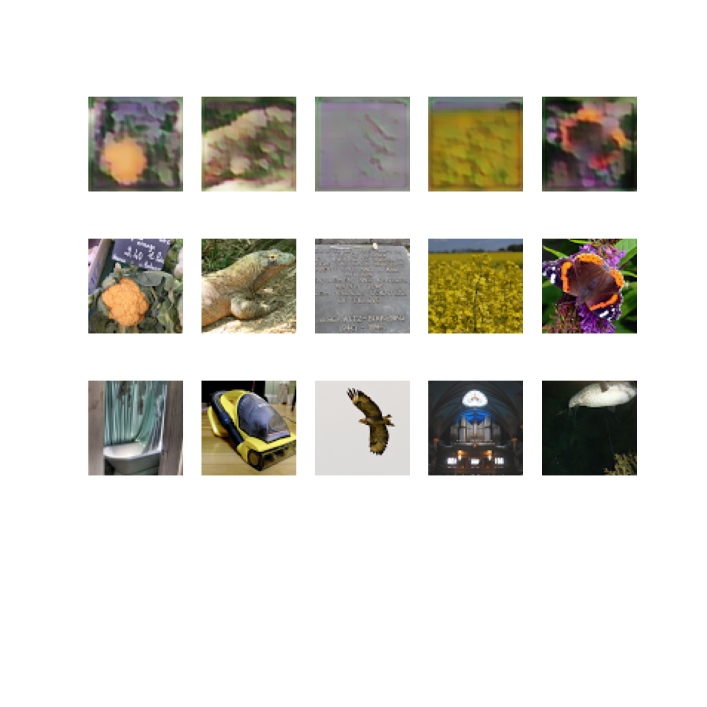

# Development of an Adaptable Deep Learning Model for Artistic Style Transfer

## 1. Project Overview

The Art Style Transfer Project aims to create a deep learning model for transferring artistic styles between images. The model takes two input images, one for content and the other for style, producing a stylized output that combines the content of one with the style of the other.

### 1.1 Model Architecture

The core of the model is a generator neural network designed for artistic style transfer. The input images are of size 64x64x3, processed through convolutional layers for initial feature extraction. The generator then concatenates content and style features, applies intermediate convolutional layers, utilizes residual blocks for feature enhancement, and employs upsampling layers. The final convolutional layer produces a stylized image with RGB channels. Loss functions include binary cross-entropy and perceptual loss, optimized using the Adam optimizer. The training loop minimizes both pixel-wise losses and perceptual losses, ensuring the preservation of content while transferring style.

## 2. Dataset Selection

The model is trained on the ImageNet dataset, a comprehensive collection of labeled images covering diverse categories. The choice of a 64x64 resolution strikes a balance between computational efficiency and training speed, allowing for quicker model iteration and experimentation during development.

## 3. Training

### 3.1 Train-Validation-Test Split

Training and testing data paths:
- Training Data: `Data\train_64x64\train_64x64`
- Testing Data: `Data\test_64x64\test_64x64`

### 3.2 Loss Functions

The training process incorporates a combination of l1 and l2 losses, generator loss, and perceptual loss functions.

## 4. Examples and Visualizations

Example results and visualizations can be found in the "Result Folder."

## 5. Limitations and Potential Improvements

### 5.1 Limitations

- Lack of proper image reconstruction.
- Inaccurate transfer of style.

### 5.2 Potential Improvements

- Implementing a Discriminator for better style transfer.
- Utilizing mid-layer attributes for more nuanced attribute transfer.
- Experimenting with hyperparameters to enhance style transfer performance.

## 6. Summary

The style transfer is achieved by combining pixel-wise loss for one image with perceptual loss for the style image. The project provides a foundation for further improvements and experimentation in the realm of artistic style transfer.
